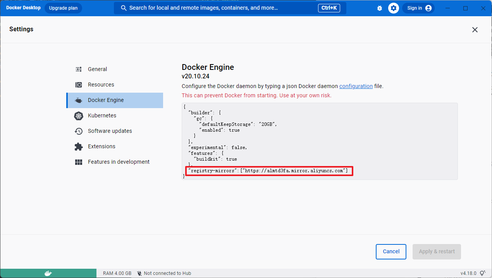

# Docker

## 基本概念

[推荐阅读——阮一峰博客](http://www.ruanyifeng.com/blog/2018/02/docker-tutorial.html)

### 镜像(Image)

可以理解为类

一堆只读层(read-only layer)的统一视角。**Docker 把应用程序及其依赖，打包在 image 文件里面。**只有通过这个文件，才能生成 Docker 容器。同一个 image 文件，可以生成多个同时运行的容器实例。

image 是二进制文件

实际开发中，一个 image 文件往往通过继承另一个 image 文件，加上一些个性化设置而生成

### Container(容器)

可以理解为类实例

与镜像的区别是容器的最上面那一层是可读可写的

实际上容器=镜像+读写层

容器本身也是一个文件，成为容器文件。关闭容器并不会删除容器文件，只是容器停止运行而已。

### Repository(仓库)

Docker仓库的概念与git类似

`Docker` 使用 `C/S` 结构

集中存放镜像文件的场所

一个 `Docker Registry` 中可以包含多个仓库 `(Repository)` ，每个仓库可以包含多个标签 `(Tag)`，每个标签对应着一个镜像。

通常，**一个仓库会包含同一个软件不同版本的镜像**，而**标签就常用于对应该软件的各个版本**。

通过`<仓库名>:<标签>`的格式来指定具体是这个软件哪个版本的镜像。如果不给出标签，将以 `latest` 作为默认标签.。

## 安装Docker

### Ubuntu下安装Docker

[参考文档](https://docs.docker.com/install/linux/docker-ce/ubuntu/#install-docker-ce-1)

```
Older versions of Docker were called docker, docker.io , or docker-engine. If these are installed, uninstall them:

sudo apt-get remove -y docker docker-engine docker.io

It’s OK if apt-get reports that none of these packages are installed.
```

```
更新apt包索引

sudo apt-get update
```

```
安装以下包以使apt可以通过HTTPS使用存储库（repository）

sudo apt-get install -y apt-transport-https ca-certificates curl software-properties-common
```

```
添加Docker的官方GPG密钥

curl -fsSL https://download.docker.com/linux/ubuntu/gpg | sudo apt-key add -
```


```
设置稳定的存储库
sudo add-apt-repository \
   "deb [arch=amd64] https://download.docker.com/linux/ubuntu \
   $(lsb_release -cs) \
   stable"
```

```
更新apt包索引
sudo apt-get update
```

```
安装最新版本的Docker
sudo apt-get install docker-ce docker-ce-cli containerd.io

通常在生产环境中会指定Docker版本：
列出所有可用的仓库：apt-cache madison docker-ce
下载制定版本的Docker：
sudo apt-get install docker-ce=<VERSION_STRING> docker-ce-cli=<VERSION_STRING> containerd.io
```

```
验证Docker是否安装成功
docker version
或者
docker info

sudo docker run hello-world
```

```bash
将仓库修改为国内镜像
sudo vi /etc/default/docker
在底部加上
DOCKER_OPTS="--registry-mirror=https://registry.docker-cn.com"
```

### 离线安装Docker

rpm安装

```
rpm -ivh *.rpm
```

## 常用命令

### Docker服务常用命令

#### 启动Docker服务

```
sudo service docker start
sudo systemctl start docker
```

#### 查看Docker服务状态

```
sudo systemctl status docker
```

#### 重启Docker

```
sudo service docker restart
```

#### 设置docker开机自启

```
sudo systemctl enable docker
```

#### 添加当前用户可执行权限

```
sudo usermod -aG docker username
```

### Docker客户端常用指令

#### 登录镜像仓库

```
docker login git.xxx.com:9999
```

#### 镜像相关命令

##### 拉取镜像

```
docker pull library/hello-world:14.04
libary是image文件所在的组，hello-world:14.04是image文件名，
libary是Docker官方仓库的默认组，可省去
```

##### 查看本机镜像文件

```
docker images   --no-trunc 显示完整描述
```

##### 删除本机镜像文件

```
docker rmi [容器id]    -f表示强制删除
```

##### 搜索仓库中的镜像

```
docker search
```

##### 运行镜像文件生成容器

```
运行image文件生成容器   docker run
docker run具有自动抓取 image 文件的功能。如果发现本地没有指定的 image 文件，就会从仓库自动抓取。

run参数：
-d 表示在后台运行容器
-t 伪终端
-i 交互模式
-p 宿主机端口：容器暴露端口   表示端口映射
-v 宿主机目录：容器目录      将宿主机目录映射到容器目录
--name  指定容器名称    如果没有指定，将生成随机名称
--network   指定容器网络
--restart=always   开机自启
```

##### 使用Dockerfile创建镜像

```
docker build   可对cpu、内存等进行限制
docker build -t (镜像名) (Dockerfile所在目录,其中`.`代表点前目录)
```

##### 保存镜像

```
docker save -o (xxx.tar) (镜像名称)
docker save (镜像名称) > (xxx.tar)
例如：
docker save busybox > busybox.tar
docker save -o busybox.tar busybox
```

##### 加载镜像

```
docker load < (xxx.tar)
docker load -i (xxx.tar)
```

##### 指定镜像tag

```
docker tag SOURCE_IMAGE[:TAG] TARGET_IMAGE[:TAG]
```

##### 清理镜像

https://docs.docker.com/config/pruning

https://docs.docker.com/engine/reference/commandline/image_prune/#description

> 虚悬镜像(dangling image) ，未标记且不被任何容器引用的镜像

```
docker image prune
docker images -f dangling=true
```

#### 容器相关命令

##### 列出本机正在运行的容器

```
docker ps    -a  列出所有容器,包括停止运行的    --no-trunc  显示完整描述
```

##### 查看容器详情

```
docker inspect [容器名] 
```

##### 终止容器

```
docker kill  比 docker stop 快
```

##### 删除容器文件

```
docker rm
docker rm -f $(docker ps -aq)  删除全部容器 
```

##### 进入容器

```bash
在运行的容器中执行命令，与运行中的容器进行通信
docker exec [-itd] [容器名称] 命令
-d  后台
-t  伪终端
-i  交互模式，即使没有附加-i，STDIN(标准输入)也保持打开 

docker exec -it 5571842d72e8 /bin/bash
docker exec -it 5571842d72e8 /bin/sh
docker exec -it 5571842d72e8 /bash
```

##### 启动容器

```
docker start
```

##### 重启容器

```
docker restart
```

##### 数据拷贝

```
docker cp ./libs 5571842d72e8:/usr/share/jitsi-meet
docker cp 5571842d72e8:/usr/share/jitsi-meet ./libs 
```

##### 从容器创建新镜像

```
docker commit 5571842d72e8 jitsi/web:2.0.7577
```

##### 查看日志

```
docker logs -f 5571842d72e8 --tail=200
```

## Dockerfile构建镜像

创建名为Dockerfile的文件

可以创建`.dockerignore`文件用于排除文件，它在docker加载Dockerfile之前加载

### Dockerfile  常用指令(不区分大小写)：

#### FROM

指定基础镜像，可以有多个from，image层叠加
```
from python          默认为latest
from python:3.8
```
#### MAINTAINER

指定该镜像维护者信息
```
maintainer lizhanxu 934035362@qq.com
```

#### WORKDIR

指定容器内的工作目录，其它指令可以根据该路径使用相对路径
```
workdir /path/to/workdir
```
#### RUN

执行指定脚本命令
```
run python hello.py
run ["python","hello.py"]            两种写法
```

#### CMD

容器启动时执行的命令,每个Dockerfile只能有一条CMD有效，多条CMD只执行最后一条
```
cmd python hello.py
cmd ["python","hello.py"]
```

#### ENTRYPOINT

容器启动后执行的命令，每个Dockerfile只能有一条ENTRYPOINT有效，多条ENTRYPOINT只执行最后一条。

#### EXPOSE

指定容器暴露的内部端口
```
expose 80
expose 8080 9191     暴露多个端口
```

#### ADD

复制指定src到dest，可以是文件、目录、远程URL资源。会复制目录下的所有内容，不会复制目录本身。复制压缩包会自动解压。可以使用通配符，如$PWD。
```
add <src> <dest>
```
#### COPY

与ADD区别：不能复制远程URL资源，不能解压文件

#### ENV

设置环境变量
```
env <key> <value>
env <key>=<value> <key>=<value>
```
## Docker镜像管理

DockerHub——Docker官方远程仓库

Docker Registry——本地私有化仓库

k8s

harbor

## Docker网络管理

容器处在相同网络下才能进行通信。

一个容器可以同时处在多个网络中。

bridge驱动网络(桥接网络，单主机互联，非集群环境)为默认的网络管理方式 。

host和none属于无网络


**默认网络管理**方式的容器无法使用容器名进行通信，单纯使用IP进行通信是不可靠的，因为多数情况下IP是动态分配的。可以使用`docker run`的`--link`参数，`--link [容器名]:[别名]`，在启动容器时进行容器连接，然后就该容器可以使用容器名与指定容器进行通信，但反之以容器名通信不行。**所以更推荐自定义网络**。

### 常用命令

```
docker network ls        查看Docker中的所有网络
docker network inspect [网络名]     查看指定网络情况
docker inspect [容器名]   查看容器详情，包括其网络情况
docker network create -d [驱动名] [网络名]   创建一个基于指定驱动的网络
docker network rm [网络名]    移除指定网络(移除之前一定要将所有与该网络连接的容器断开)
可以使用docker run 的--network参数为容器制定网络
docker network connect [网络名] [容器名]   为容器添加网络
docker network disconnect [网络名] [容器名]   为容器断开网络
```
### Docker Swarm

创建和管理Docker集群的工具

集群管理、容器编排

Docker源生的集群管理工具

比较成熟的容器集群管理工具：Google的K8s和Appache的Mesos

## Docker数据管理

## docker-compose

### docker-compose.yml参数

```
version: '3.5'

services:
  fs-usercenter:
    image: fs-usercenter:latest      //镜像名称
    network_mode: host               //网络模式，默认bridge
    hostname: fs-usercenter          //
    container_name: fs-usercenter    // 容器名称
    privileged: true                 // 给容器root权限
    restart: always                  // 自动重启
    volumes:                         // 卷映射，持久化数据
      - ./data/config:/work/fs-usercenter/config
      - ./data/logs:/work/fs-usercenter/logs
    env_file:                        // 设置环境变量文件
      - ../../flyshare.env
    environment:                     // 设置环境变量
      - TZ=Asia/Shanghai
      - JAVA_OPTS=-Xms256m -Xmx1g
      - nacos.config.server-addr=127.0.0.1:5080
      - nacos.config.username=nacos-api
      - nacos.config.password=kBfTvU4uiPGA7KV0JB/enQ==
      - nacos.config.remote-first=true
      - nacos.config.bootstrap.logEnable=true
      - LOG_HOME=/work/fs-usercenter/logs
```

### 环境变量

#### 容器引用变量的优先级

```
Compose file
Shell environment variables
Environment file
Dockerfile
Variable is not defined
```

1. **compose file中只能引用 Shell环境变量、`.env` 环境文件**。引用不到Dockerfile中定义的变量，也引用不了env_file设置的文件中变量。
2. compose file中的变量是不能互相引用的。即设置一个变量时，引用内部的一个变量则结果是空值。
3. 很多默认值，则可以使用 .env 环境变量文件解决。
4. /etc/profile等变量并不会对容器生效。

#### 环境变量的设置方式

##### compose file

```
version: '2'
services:
  data-tag-biz:
    image: 192.168.1.XX/xxxx/data-standard-biz:9.0
    network_mode: "host"
    restart: always
    ports:
      - 10015:9015
    environment:
      - NACOS-HOST=${NACOS_HOST}
      - SW_NAME=test:${SV_NAME}
      - SW_SERVICES=192.168.1.XX:11800
      - TRACK=-javaagent:/opt/skywalking-agent.jar
      - JAVA_OPTS=-Xms512m -Xmx1024m -XX:SurvivorRatio=8 -XX:+UseConcMarkSweepGC
    container_name: data-standard-biz-9
```

##### shell环境变量

```
export SV_NAME=data-standard-biz
```

##### 环境变量文件

docker原生命令

```
docker run --env-file=web-variables.env
```

compose file中指定

```
version: '3'
services:
  data-tag-biz:
    env_file:
      - ../file.env   #相对于docker-compose.yml文件的位置。
    environment:
      - SV_NAME=data-standard-biz
      - NACOS-HOST=${NACOS_HOST}
      - SW_NAME=test:${SV_NAME}
      - SW_SERVICES=192.168.1.XX:11800
      - TRACK=-javaagent:/opt/skywalking-agent.jar
      - JAVA_OPTS=-Xms512m -Xmx1024m -XX:SurvivorRatio=8 -XX:+UseConcMarkSweepGC
    container_name: data-standard-biz-9
```

.env文件

在docker-compose.yml同级目录中加入`.env`文件，则可以设置docker-compose环境变量的默认值，可以在docker-compose中引用到的。

### 查看当前配置

```
 docker-compose config
```

### 启动指定服务

```
docker-compose up -d <service_name>
```

## Docker Desktop

### 设置镜像仓库



```
"registry-mirrors":["https://almtd3fa.mirror.aliyuncs.com"]
```

### 设置代理

## Docker离线安装

[下载安装包](https://download.docker.com/linux/static/stable/x86_64/)

```
tar -zxvf docker-20.10.16.tgz
cp -p docker/* /usr/bin
```

注册为系统服务

```
vim /usr/lib/systemd/system/docker.service
```

```
[Unit]
Description=Docker Application Container Engine
Documentation=http://docs.docker.com
After=network.target docker.socket
[Service]
Type=notify
EnvironmentFile=-/run/flannel/docker
WorkingDirectory=/usr/local/bin
ExecStart=/usr/bin/dockerd \
                -H tcp://0.0.0.0:4243 \
                -H unix:///var/run/docker.sock \
                --selinux-enabled=false \
                --log-opt max-size=1g
ExecReload=/bin/kill -s HUP $MAINPID
# Having non-zero Limit*s causes performance problems due to accounting overhead
# in the kernel. We recommend using cgroups to do container-local accounting.
LimitNOFILE=infinity
LimitNPROC=infinity
LimitCORE=infinity
# Uncomment TasksMax if your systemd version supports it.
# Only systemd 226 and above support this version.
#TasksMax=infinity
TimeoutStartSec=0
# set delegate yes so that systemd does not reset the cgroups of docker containers
Delegate=yes
# kill only the docker process, not all processes in the cgroup
KillMode=process
Restart=on-failure
[Install]
WantedBy=multi-user.target
```

设置开机启动

```
systemctl enable docker
```

## 常见问题

### 容器内无法访问外部网络

```
查看转发
firewall-cmd --query-masquerade

查看配置
sysctl -p

配置转发
vi /etc/sysctl.conf
net.ipv4.ip_forward = 1

开启转发
firewall-cmd --add-masquerade --permanent
```

### 无权限

```
permission denied while trying to connect to the Docker daemon socket at unix:///var/run/docker.sock: Get "http://%2Fvar%2Frun%2Fdocker.sock/v1.24/containers/json": dial unix /var/run/docker.sock: connect: permission denied
```

这个错误通常表示当前用户没有权限访问 Docker 守护进程。要解决这个问题，您可以尝试以下几种方法：

1. **将用户添加到 Docker 用户组**：将当前用户添加到 Docker 用户组中，以便无需使用 sudo 权限即可运行 Docker 命令。请注意，这可能需要重新登录才能生效。首先，确保 Docker 用户组存在：

   ```
   sudo groupadd docker
   ```

   然后将当前用户添加到 Docker 用户组中：

   ```
   sudo usermod -aG docker $USER
   ```

   最后，注销并重新登录。

2. **检查 Docker 守护进程的权限**：确保 `/var/run/docker.sock` 文件的权限正确。它应该属于 `docker` 组，并且权限为 `660`。您可以使用以下命令更正权限：

   ```
   sudo chown root:docker /var/run/docker.sock
   sudo chmod 660 /var/run/docker.sock
   ```

3. 限制容器仅本机/宿主机访问

   ```
       ports:
         - '127.0.0.1:50000:5000'
   ```

4. 
