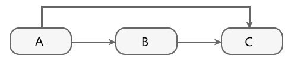

# Maven

https://maven.apache.org/

## 介绍

> 一个标准化的项目管理和构建工具
>
> Maven使用java编写的，跨平台
>
> Maven使用约定优于配置的原则，应该尽可能遵守标准目录结构

## 约定目录

|目录|目的|
|--------|--------|
|${basedir}	|存放pom.xml和所有的子目录|
|${basedir}/src/main/java	|项目的java源代码|
|${basedir}/src/main/resources|	项目的资源，比如说property文件，springmvc.xml|
|${basedir}/src/test/java	|项目的测试类，比如说Junit代码|
|${basedir}/src/test/resources|	测试用的资源|
|${basedir}/src/main/webapp/WEB-INF	|web应用文件目录，web项目的信息，比如存放web.xml、本地图片、jsp视图页面|
|${basedir}/target	|打包输出目录|
|${basedir}/target/classes	|编译输出目录|
|${basedir}/target/test-classes|	测试编译输出目录|
|Test.java	|Maven只会自动运行符合该命名规则的测试类|
|~/.m2/repository	|Maven默认的本地仓库目录位置|

## 安装

### 下载

> https://maven.apache.org/download.cgi
>
> -bin是编译好的，-src需要自己编译

### 设置Maven环境变量

> 新建系统变量 **MAVEN_HOME**，变量值：**E:\Maven\apache-maven-3.3.9**（Maven安装目录）
>
> 编辑系统变量 **Path**，添加变量值：**;%MAVEN_HOME%\bin**
>
> mvn -version

## POM

https://maven.apache.org/pom.html

https://maven.apache.org/ref/3.8.6/maven-model/maven.html

> Project Object Model 项目对象模型
>
> Maven工程的基本单元，是一个XML文件，即pom.xml

### [The Super Pom](http://maven.apache.org/pom.html#The_Super_POM)

> 所有的POM均隐式继承自一个父POM，这个父POM被称为Super POM
> Maven使用effective pom(Super POM的配置加上项目的配置）来执行相关任务
> mvn help:effective-pom   可以查看effective pom

### Elements

- **project**

  所有Maven pom.xml文件中的顶级元素

- **modelVersion**

  此 POM 使用的对象模型的版本，很少改动

  对于Maven2及Maven 3来说，固定为4.0.0

- **parent**

  给出父项目的maven坐标

#### The Basics

> maven坐标 ：   `groupId:artifactId:version`

* **groupId**

  创建项目的组织或组的唯一标识符，项目的关键标识符之一，通常基于组织的完全限定域名

* **artifactId**

  此项目正在生成的主要工件的唯一基本名称。项目的主要工件通常是 JAR 文件

  由 Maven 生成的典型工件的格式为`<artifactId>-<version>.<extension>`
  
* **version**

  此项目生成的工件的版本

* **packaging**

  打包方式，默认`jar`，还有pom,jar,maven-plugin,ejb,war,ear,rar

* **properties**

  包含可在 POM 中的任何位置访问的值占位符

* **dependencies**

  依赖列表，包含多个dependency，以下是dependency属性

  * `groupId:artifactId:version`得到maven坐标

  * **classifier**

    The classifier distinguishes artifacts that were built from the same POM but differ in content.

    比如区分jdk8和jdk11

    比如区分linux-x86_64和windows-x86_64

  * **type**

    对应于选择的依赖类型。这默认为`jar`. 

  * **scope**  依赖的作用域

    https://maven.apache.org/guides/introduction/introduction-to-dependency-mechanism.html#dependency-scope

    * compile 默认，在整个项目中都可用，这些依赖关系会传播到依赖项目，参与打包
    * provided 该依赖编写源代码时需要，预计jdk或者容器已经提供，不参与打包
    * runtime 该依赖编写代码时不需要，运行时需要，参与打包
    * test  该依赖只能在测试代码中使用，并且不参与打包的
    * system 表示使用本地系统路径下的jar包，需要和一个systemPath一起使用
    * import  仅在dependencyManagement中使用

  * [**exclusions**](#可选依赖和排除依赖)

  * **systemPath**
  
    本地依赖的路径

    `<systemPath>${project.basedir}/lib/ojdbc6-11.2.0.3.jar</systemPath>`

* **dependencyManagement**

#### Build Settings

* **build**

  处理诸如声明项目的目录结构和管理插件之类的事情
  
  * **pluginManagement**
  
    类似dependencyManagement，管理插件

#### More Project Information

- **name**

  用于项目的显示名称。这经常在 Maven 生成的文档中使用。

- **url**

  可以找到项目站点的位置。这经常在 Maven 生成的文档中使用。

#### **Environment Settings**

* **repositories**

  配置当前工程使用的远程仓库
  
* **pluginRepositories**

  配置当前工程maven插件使用的远程仓库

## 生命周期

> 生命周期（lifecycle）可以理解成由各种plugin按照一定的顺序执行来完成java项目清理、编译、打包、测试、布署等整个项目的流程的一个过程。

### default(build)

>构建项目
>
>当一个阶段通过 Maven 命令调用时，例如 mvn package，只有该阶段之前以及包括该阶段在内的所有阶段会被执行。

#### 常用生命周期

> 验证(validate)—>编译(compile)—>测试(test)—>打包(package)—>检查(verify)—>安装(install)—>部署(deploy)

#### 全生命周期

| 阶段                      | 描述                                                         |
| ------------------------- | ------------------------------------------------------------ |
| `validate`                | 确认：确认项目是正确的，所有必要的信息都是可用的             |
| `initialize`              | 初始化：初始化构建状态，例如设置属性或创建目录               |
| `generate-sources`        | 生成源码：生成编译中包含的任何源代码。                       |
| `process-sources`         | 处理源代码：例如过滤任何值                                   |
| `generate-resources`      | 生成资源：生成所有需要包含在打包过程中的资源文件             |
| `process-resources`       | 处理资源：将资源复制并处理到目标目录中，准备打包             |
| `compile`                 | 编译                                                         |
| `process-classes`         | 对编译生成的文件进行后处理，例如对Java类进行字节码增强       |
| `generate-test-sources`   | 生成编译中包含的任何测试源代码                               |
| `process-test-sources`    | 处理测试源代码，例如过滤任何值。                             |
| `generate-test-resources` | 生成测试资源                                                 |
| `process-test-resources`  | 将资源复制并处理到测试目标目录中                             |
| `test-compile`            | 将测试源代码编译到测试目标目录中                             |
| `process-test-classes`    | 对测试编译生成的文件进行后处理，参考`process-classes`        |
| `test`                    | 测试                                                         |
| `prepare-package`         | 预打包：在包装前进行任何必要的准备工作                       |
| `package`                 | 打包：将编译后的代码打包成可分发的格式，例如JAR包            |
| `pre-integration-test`    | 预集成测试：在执行集成测试之前执行所需的操作                 |
| `integration-test`        | 集成测试：处理和部署到可以运行集成测试的环境中               |
| `post-integration-test`   | 后集成测试：执行集成测试后所需的操作                         |
| `verify`                  | 验证：运行任何检查来验证包是否有效并满足标准                 |
| `install`                 | 安装：将包安装到本地存储库中，作为本地其他项目中的依赖项使用 |
| `deploy`                  | 打包：将最终的包复制到远程存储库，以便与其他开发人员和项目共享 |

### clean

> 清理项目
>
> pre-clean—>clean—>posst-clean
>
> mvn clean

### site

> 生成网站
>
> Maven 不仅仅是一款项目构建和依赖管理工具，它还能够聚合项目信息，促进项目团队间地交流。POM 中可以包含各种项目信息，例如：项目描述、SCM 地址、许可证信息，开发者信息等。用户可以使用 Maven 提供的 maven-site-plugin 插件让 Maven 生成一个 Web 站点， 以站点的形式发布以上信息。
>
> mvn site
>
> 生成在target/site目录下
>
> pre-site—>site—>post-site—>site-deploy

### install

```
mvn install // 编译项目->运行测试->打包->安装到本地仓库
注：对于同一个依赖，本地仓库优先于远程仓库，只有当本地仓库没有时才会从远程仓库下载

mvn clean install -U  // 强制 Maven 更新依赖，即使本地仓库中已有
注：本地仓库优先可以提高构建的速度，并且减轻远程仓库的负担
```

## 仓库

> 用于存放项目所需要的jar包，多个项目共享一个仓库里的相同jar包

### maven项目使用的仓库

1. 中央仓库，这是默认的仓库，maven社区提供

2. 镜像仓库，通过 sttings.xml 中的 settings.mirrors.mirror 配置

3. 全局profile仓库，通过 settings.xml 中的 settings.repositories.repository 配置

4. 项目仓库，通过 pom.xml 中的 project.repositories.repository 配置

5. 项目profile仓库，通过 pom.xml 中的 project.profiles.profile.repositories.repository 配置

6. 本地仓库，默认位置 : ${user.home}/.m2/repository

   在settings.xml中显示指定   `<localRepository>D:\develop\maven\repo</localRepository>`

### 依赖查找顺序

> 本地模块 > local_repo > settings_profile_repo > pom_profile_repo > pom_repositories > settings_mirror > central

### 修改为阿里云仓库

https://developer.aliyun.com/mvn/guide

```
 在settings.xml添加如下镜像
<mirror>
  <id>aliyunmaven</id>
  <mirrorOf>*</mirrorOf>
  <name>阿里云公共仓库</name>
  <url>https://maven.aliyun.com/repository/public</url>
</mirror>
 或者在项目的pom.xml中添加
 <repositories>
     <repository>
         <id>alimaven</id>
         <name>aliyun maven</name>
         <url>http://maven.aliyun.com/nexus/content/groups/public/</url>
         <releases>
             <enabled>true</enabled>
         </releases>
         <snapshots>
             <enabled>false</enabled>
         </snapshots>
     </repository>
 </repositories>
```

## Maven的配置文件

### 项目级

项目的pom.xml文件

### 用户级

${user.home}\.m2\settings.xml

### 全局

maven安装目录下

D:\apache-maven-3.6.2\conf\settings.xml

## IDEA中的Maven

### 内置maven

> IDEA默认带有两个版本的Maven(Maven2、Maven3)，默认选择Maven3
>
> 可以在Settings->Build->Build Tools->Maven中修改Maven相关
>
> Maven 3.6.2版本和IDEA存在兼容性问题，降低到3.6.1版本就没有这个问题了

### 添加依赖的方式
* 在pom.xml中使用alt+insert快捷键添加和管理依赖
* 在各大仓库的网站上搜索依赖，会提供添加依赖的代码或者直接下载jar包      https://mvnrepository.com
* 在Module上右键，点击Open Module Settings（F4），弹出Project Structure窗口
    Modules->选择模块->Dependencies->点+号->Library->New Library->From Maven->搜索依赖并添加

## Maven中的属性

### 内置属性

> Maven预定义属性，用户可以直接使用

```
${basedir}表示项目的根路径，即包含pom.xml文件的目录
${version}表示项目版本
${project.basedir}同${basedir}
${project.baseUri}表示项目文件地址
${maven.build.timestamp}表示项目构建开始时间
${maven.build.timestamp.format}表示${maven.build.timestamp}的展示格式，默认值为yyyyMMdd-HHmm
```

### pom属性

> 使用pom属性可以引用到pom.xml文件中对应元素的值

```
${project.build.sourceDirectory}表示主源码路径，默认为src/main/java/
${project.build.testSourceDirectory}表示测试源码路径，默认为src/test/java/
${project.build.directory}表示项目构建输出目录，默认为target/
${project.outputDirectory}表示项目测试代码编译输出目录，默认为target/classes/
${project.groupId}表示项目的groupId
${project.artifactId}表示项目的artifactId
${project.version}表示项目的version，同${version}
${project.build.finalName}表示项目打包输出文件的名称,默认为${project.artifactId}${project.version}
```

### 自定义属性

> 在pom.xml文件的<properties>标签下定义的Maven属性

```
定义属性：
<project>
    <properties>
    	<mysql.version>5.6.32</mysql.version>
    </properties>
</project>
使用属性：
<dependency>
    <groupId>mysql</groupId>
    	<artifactId>mysql-connector-java</artifactId>
    <version>${mysql.version}</version>
</dependency>
```

### setting.xml文件属性

> 与pom属性同理，用户可以用settings.开头的属性引用setting.xml文件的xml元素值

```
${settings.localRepository}表示本地仓库的地址
```

### Java系统属性

> 所有的Java属性都可以使用Maven属性引用

```
mvn help:system 可以查看所有的Java属性
System.getProperties() 可以得到所有的Java属性
${user.home} 表示用户目录
```

### 环境变量属性

> 所有的环境变量都可以以env.开头的Maven属性引用

```
mvn help:system 可查看所有的环境变量
${env.JAVA_HOME} 表示JAVA_HOME环境变量的值
```

## 继承

> 子模块可以通过继承获得父模块中声明的全部依赖
>
> 父模块的目的是为了消除子模块 POM 中的重复配置，其中不包含有任何实际代码，因此父模块 POM 的打包类型（packaging）必须是 pom。

### 子模块

```
<parent>
    <artifactId>parent</artifactId>
    <groupId>com.song</groupId>
    <version>1.0-SNAPSHOT</version>
    <relativePath>../pom.xml</relativePath> <!-- 父模块POM的相对路径，默认值为../pom.xml -->
</parent>
<modelVersion>4.0.0</modelVersion>
<artifactId>childA</artifactId>
<packaging>jar</packaging>
```

### dependencyManagement

- 在该元素下声明的依赖不会实际引入到模块中，只有在子模块的 dependencies 元素下同样声明了该依赖，才会引入到模块中。

- 该元素能够约束 dependencies 下依赖的使用，即子模块的 dependencies 只需声明依赖的groupId 和 artifactId，其它元素如 version 和 scope 都能通过继承父 POM 的 dependencyManagement 得到，同时version 和 scope等元素也可以通过声明覆盖。

- 在父模块中使用 dependencyManagement 声明依赖能够统一项目内依赖的版本，子模块无须声明版本，也就不会出现多个子模块使用同一依赖项版本不一致的情况，降低依赖冲突的几率。

- dependencyManagement 声明的依赖不会被实际引入，子模块需要什么依赖就自己引入，增加了灵活性，避免引入一些不必要的依赖。

- `<scope>import</scope>`，只能在dependencyManagement中使用，将目标 pom.xml 中的 dependencyManagement 配置导入合并到当前 pom.xml 的 dependencyManagement 中

  ```
  <dependencyManagement>
      <dependencies>
          <!-- SpringBoot的依赖配置-->
          <dependency>
              <groupId>org.springframework.boot</groupId>
              <artifactId>spring-boot-dependencies</artifactId>
              <version>2.5.14</version>
              <type>pom</type>
              <scope>import</scope>
          </dependency>
      </dependencies>
  </dependencyManagement>
  ```

## 多模块(聚合)

> 具有模块（module）的项目称为多模块项目
>
> 模块是这个pom列出的项目，并作为一个组执行
>
> 打包的`pom`项目可以通过将一组项目列为模块来聚合它们的 **构建**
>
> 聚合模块仅仅是帮助聚合其他模块的工具，其本身并无任何实质内容，因此聚合模块中只有一个 POM 文件，不像其他的模块一样包含 src/main/java、src/test/java 等多个目录
>
> 聚合模块的打包方式（packaging）也是 pom

```
<packaging>pom</packaging>
<modules>
    <module>childA</module>
    <module>childB</module>
</modules>
```

## 继承与聚合

> 在实际的项目中，一个模块往往既是聚合模块又是其他项目的父模块
>
> 继承的目的是为了消除 POM 中的重复配置，聚合的目的是为了方便快速的构建项目。
>
> 对于继承中的父模块来说，它跟本不知道那些模块继承了它，但子模块都知道自己的父模块是谁。
>
> 对于聚合模块来说，它知道哪些模块被聚合了，但那些被聚合的模块根本不知道聚合模块的存在。
>
> 两者的打包方式都是 pom，两者除了 POM 外都没有实际的代码内容

## 导入本地jar包

```
<dependency>
    <groupId>com.oracle.local</groupId>
    <artifactId>ojdbc6</artifactId>
    <version>11.2.0.3</version>
    <scope>system</scope>
    <systemPath>${project.basedir}/lib/ojdbc6-11.2.0.3.jar</systemPath>
</dependency>
```

## 依赖

### 依赖传递

http://c.biancheng.net/maven2/dependency-delivery.html

> Maven 依赖传递是 Maven 的核心机制之一，简化配置



项目 A 依赖于项目 B，B 又依赖于项目 C，此时 B 是 A 的直接依赖，C 是 A 的间接依赖。

Maven 的依赖传递机制是指：不管 Maven 项目存在多少间接依赖，POM 中都只需要定义其直接依赖，不必定义任何间接依赖，Maven 会动读取当前项目各个直接依赖的 POM，将那些必要的间接依赖以传递性依赖的形式引入到当前项目中。

为了解决依赖传递造成的依赖重复，依赖冲突等问题，Maven提供了一下六种机制。

### 依赖范围（Dependency scope）

>Maven 在对项目进行编译、测试和运行时，会分别使用三套不同的 classpath。

Maven 具有以下 6 中常见的依赖范围，如下表所示。

| 依赖范围 | 描述                                                         |
| -------- | ------------------------------------------------------------ |
| compile  | 编译依赖范围，scope 元素的缺省值。使用此依赖范围的 Maven 依赖，对于三种 classpath 均有效，即该 Maven 依赖在上述三种 classpath 均会被引入。例如，log4j 在编译、测试、运行过程都是必须的。 |
| test     | 测试依赖范围。使用此依赖范围的 Maven 依赖，只对测试 classpath 有效。例如，Junit 依赖只有在测试阶段才需要。 |
| provided | 已提供依赖范围。使用此依赖范围的 Maven 依赖，只对编译 classpath 和测试 classpath 有效。例如，servlet-api 依赖对于编译、测试阶段而言是需要的，但是运行阶段，由于外部容器已经提供，故不需要 Maven 重复引入该依赖。 |
| runtime  | 运行时依赖范围。使用此依赖范围的 Maven 依赖，只对测试 classpath、运行 classpath 有效。例如，JDBC 驱动实现依赖，其在编译时只需 JDK 提供的 JDBC 接口即可，只有测试、运行阶段才需要实现了 JDBC 接口的驱动。 |
| system   | 系统依赖范围，其效果与 provided 的依赖范围一致。其用于添加非 Maven 仓库的本地依赖，通过依赖元素 dependency 中的 systemPath 元素指定本地依赖的路径。 |
| import   | 导入依赖范围，该依赖范围只能与 dependencyManagement 元素配合使用，其功能是将目标 pom.xml 文件中 dependencyManagement 的配置导入合并到当前 pom.xml 的 dependencyManagement 中。 |

#### 依赖范围对传递依赖的影响

项目 A 依赖于项目 B，B 又依赖于项目 C，此时我们可以将 A 对于 B 的依赖称之为第一直接依赖，B 对于 C 的依赖称之为第二直接依赖。
B 是 A 的直接依赖，C 是 A 的间接依赖，根据 Maven 的依赖传递机制，间接依赖 C 会以传递性依赖的形式引入到 A 中，但这种引入并不是无条件的，它会受到依赖范围的影响。

|          | compile  | test | provided | runtime  |
| -------- | -------- | ---- | -------- | -------- |
| compile  | compile  | -    | -        | runtime  |
| test     | test     | -    | -        | test     |
| provided | provided | -    | provided | provided |
| runtime  | runtime  | -    | -        | runtime  |

注：上表中，左边第一列表示第一直接依赖的依赖范围，上边第一行表示第二直接依赖的依赖范围。交叉部分的单元格的取值为传递性依赖的依赖范围，若交叉单元格取值为“-”，则表示该传递性依赖不能被传递。

- 当第二直接依赖的范围是 compile 时，传递性依赖的范围与第一直接依赖的范围一致；
- 当第二直接依赖的范围是 test 时，传递性依赖不会被传递；
- 当第二直接依赖的范围是 provided 时，只传递第一直接依赖的范围也为 provided 的依赖，且传递性依赖的范围也为 provided；
- 当第二直接依赖的范围是 runtime 时，传递性依赖的范围与第一直接依赖的范围一致，但 compile 例外，此时传递性依赖的范围为 runtime。

### 依赖调解（Dependency mediation）

依赖调节遵循以下两条原则：

1. 引入路径短者优先

   当一个间接依赖存在多条引入路径时，引入路径短的会被解析使用

2. 先声明者优先

   在引入路径长度相同的前提下，POM 文件中依赖声明的顺序决定了间接依赖会不会被解析使用，顺序靠前的优先使用。

以上两条原则，优先使用第一条原则解决，第一条原则无法解决，再使用第二条原则解决。

### 可选依赖和排除依赖

假设存在这样的依赖关系，A 依赖于 B，B 依赖于 X，B 又依赖于 Y。B 实现了两个特性，其中一个特性依赖于 X，另一个特性依赖于 Y，且两个特性是互斥的关系，用户无法同时使用两个特性，所以 A 需要排除 X，此时就可以在 A 中将间接依赖 X 排除。

#### 排除依赖（Excluded dependencies）

- 排除依赖是控制当前项目是否使用其直接依赖传递下来的接间依赖；
- exclusions 元素下可以包含若干个 exclusion 子元素，用于排除若干个间接依赖；
- exclusion 元素用来设置具体排除的间接依赖，该元素包含两个子元素：groupId 和 artifactId，用来确定需要排除的间接依赖的坐标信息；
- exclusion 元素中只需要设置 groupId 和 artifactId 就可以确定需要排除的依赖，无需指定版本 version。

#### 可选依赖（Optional dependencies）

- 可选依赖用来控制当前依赖是否向下传递成为间接依赖；
- optional 默认值为 false，表示可以向下传递称为间接依赖；
- 若 optional 元素取值为 true，则表示当前依赖不能向下传递成为间接依赖。

#### 比较

- 排除依赖是控制当前项目是否使用其直接依赖传递下来的接间依赖；
- 可选依赖是控制当前项目的依赖是否向下传递；
- 可选依赖的优先级高于排除依赖；
- 若对于同一个间接依赖同时使用排除依赖和可选依赖进行设置，那么可选依赖的取值必须为 false，否则排除依赖无法生效。

### [依赖管理（Dependency management）](#dependencyManagement)

